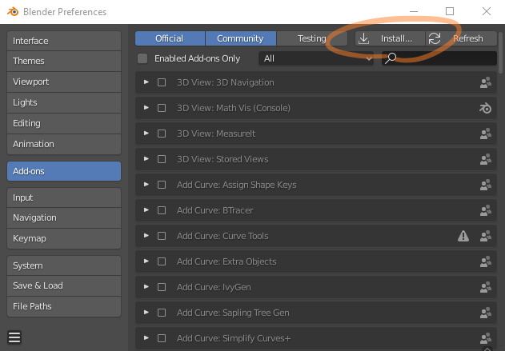
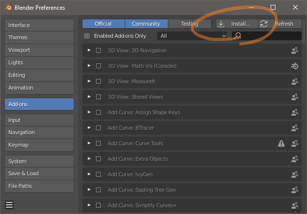
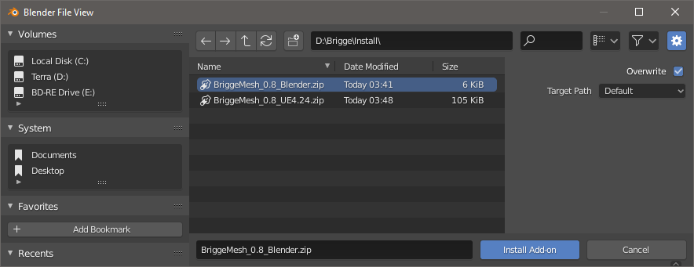
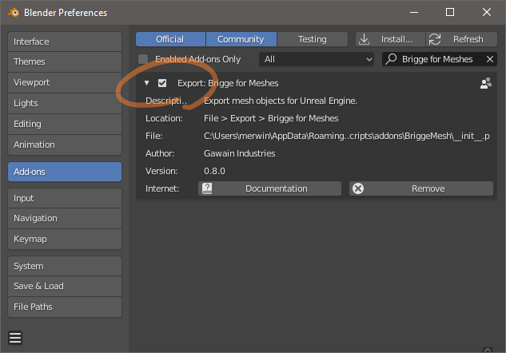
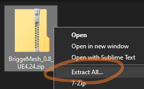
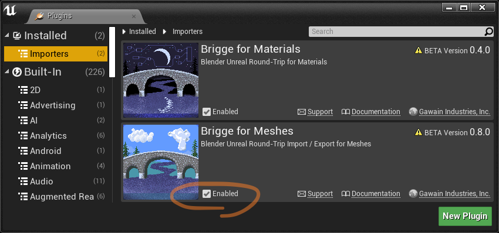
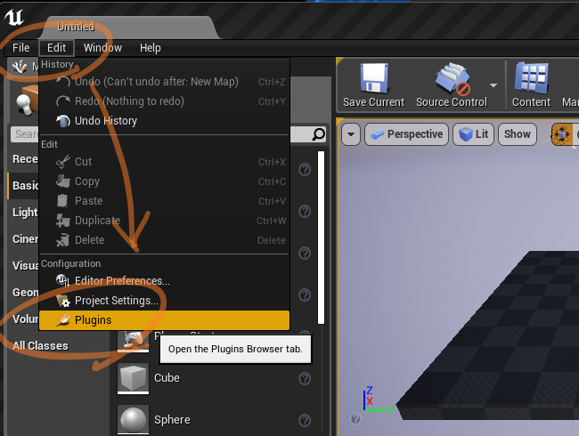
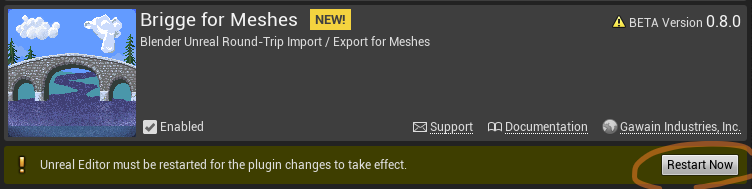

Brigge works as a set of two plugins: one for Blender and one for UE4. These plugins communicate using a custom data format.

## Install the Blender add-on
You will need:
* Blender 2.80 or later -- [get it here for free!](https://blender.org/download)
* BriggeMesh_v.v_Blender.zip from us.

1. Launch Blender
2. Open Preferences from the Edit menu

	

3. In the Add-ons section, use the Install button

	

4. Choose the Brigge...Blender.zip file

	

5. Enable the new Brigge addon.

	

Done! You can now export mesh objects using the brigge format.


## Install the Unreal Editor plugin
You will need:
* Unreal Engine 4.22 or later -- [get it here for free!](https://unrealengine.com)

	> Our plugins are built for official releases of Unreal Engine, installed from the Epic Games Launcher on Windows or Mac.
	> If your project uses a custom engine built from source, [contact us](mailto:support@gawain.industries) for installation help.

* BriggeMesh_v.v_UE4.xx.zip from us.

1. Find the plugin zip file that matches your version of Unreal Engine.

	

2. Unzip into your installation of UE4. A successful install looks like this: ```UE_4.xx/Engine/Plugins/Editor/BriggeMesh/BriggeMesh.uplugin```

	> Unreal Engine is typically installed on your computer at
	> ```C:/Program Files/Epic Games/UE_4.xx``` for Windows,
	> ```/Users/Shared/UnrealEngine/UE_4.xx``` for Mac.
	
3. Launch Unreal Engine and open your project.

4. Enable the new Brigge plugin. Unreal should automatically discover it and prompt you to manage plugins.

	
	

	You can also manage plugins at any time through Unreal's Edit menu.

	

5. Restart the Editor when asked.

	

Done! You can now import StaticMesh assets using the brigge format.
