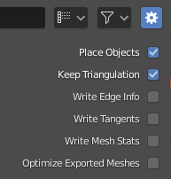

## Brigge for Meshes - Export Options

When exporting from Blender you have control over several options:



These default settings give good results, but let's look at each option in depth using an example model.


Exporting this model with all options turned **off** produces this `.brigge` file plus `Suzanne.mesh` which stores the raw geometry data.
```
mesh named 'Suzanne' {
  scale = 2
}
```
#### Place Objects
Write position and rotation so objects can be placed into the game.
```
mesh named 'Suzanne' at (0, 0, 0) {
  rotation = -27.2129 degrees about 'X'
  scale = 2
}
```
#### Keep Triangulation
Quads and n-gons will subdivide exactly the same in Blender and UE4. This is important for keeping your silhouette and shading consistent.

#### Write Edge Info
This includes edge connectivity and sharpness.

#### Write Mesh Stats
The `.brigge` file will have detailed mesh statistics in the comments. Tech artists can use this info to track their models against polygon budgets for example. It's also useful for version control to see what *exactly* changed between two versions of your asset instead of simply *"it changed"*.
```
mesh named 'Suzanne' {
  scale = 2
  # 2012 vertices
  # 1968 quads
  # PER_GPU_VERTEX NORMAL
  # PER_GPU_VERTEX TEXCOORD
  # 7872 GPU vertices
  # 3936 GPU triangles
}
```
#### Optimize Exported Meshes
Spend extra time to make `.mesh` files more compact and efficient. This helps when storage space or network bandwidth are limited.

In our Suzanne example, `Suzanne.mesh` is reduced to 65,148 bytes, versus 199,388 bytes when not optimized.

Only this line in the `.brigge` file changes:
```
  # 2320 GPU vertices
```
Which shows Brigge was able to throw out 2/3 of the GPU vertices, while keeping the exact same visual result!

Optimized meshes store normals and vertex colors in half precision, which saves half the space. Brigge always uses full precision for texture coordinates so that high resolution textures look great on your models. Vertex positons are also stored at full precision.

Why would you ever want to disable this option? When you are iterating on your artwork and want to get it into Unreal *as fast as possible* on your local machine. For faster iteration times, leave this option unchecked. You can optimize the *final* models when you are ready to share them with your team using a network drive or version control.

---
### Import Options

None! Importing into Unreal is controlled by whatever is in the `.brigge` file.

---
